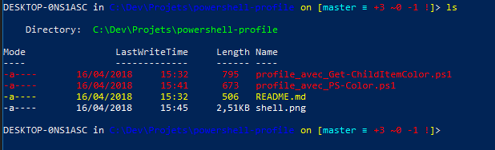

# powershell-profile
Customization du shell PowerShell (compatible Hyper et Terminus)

## Pré-requis
Installer [Posh Git](https://github.com/dahlbyk/posh-git) : `Install-Module posh-git -Scope CurrentUser`  
Installer [PS Color](https://github.com/Davlind/PSColor) : `Install-Module PSColor -Scope CurrentUser` ou [Get-ChildItemColor](https://github.com/joonro/Get-ChildItemColor) : `Install-Module Get-ChildItemColor -Scope CurrentUser`

D'autres idées de [plugin](http://joonro.github.io/blog/posts/powershell-customizations.html).

## Installation
1) Vérifier l'existence d'un profile : `Test-Path $profile`, si la réponse est 'False' il faut allors le créer.
2) Créer le profile : `New-Item -path $profile -type file –force`
3) Le fichier est normalement créé dans le répertoire `C:\Users\Jean-FrançoisLeFoll\Documents\WindowsPowerShell`
4) Maintenant nous pouvons installer Posh Git et PSColor ou Get-ChildItemColor
5) Copier le contenu du fichier de profile qui vous interesse (PSColor / Git-ChildItemColor) dans votre fichier de profile et profitez ! :)  

Voici le résultat, avec PS Color  

